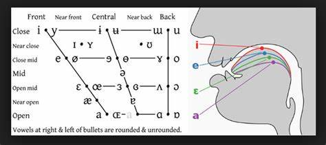

Speech Accent Detection
==============================

The human speaks a language with an accent. A particular accent necessarily reflects a person's linguistic background. The model defines accent based audio record. The result of the model could be used to determine accents and help decrease accents to English learning students and improve accents by training.

## Outline

- [About](#about)
- [Objectives](#objectives)
- [Dataset](#dataset)
- [Mel Frequency Cepstrum Coefficients](#mel-frequency-cepstrum-coefficients--mfcc-)
- [Overview](#overview-1)
- [Models](#models)
    - [FFNN](#ffnn)
    - [CNN](#cnn)
    - [LSTM](#lstm) 
- [Incorrect Classifications](#incorrect-classifications)
- [Future Work](#future-work)

### About

The English language is a global language. It is becoming a must language for most people. Since the English language going to be part of different nationals, the origin of the English language is changing based on location and the mother languages of the people in that area. So on we can find American-English, England-English, Indian-English, and other English languages. One of the significant differences between different English languages is the accent. 

Accent detection would allow us to define the student's accent level and re-train with a native speaker or for the school that wants to hire the teacher, which could determine the accent on the teacher. 

### Objective
+ The model can classify the speaker's accent based on the audio file (Wav format).

### Dependencies:
The model runs on Ubuntu 18.04
Python requirement libraries in requirements.txt
Moreover needs:
- Python 3.7 (https://www.python.org/download/releases/3.7/)
    -Keras (https://keras.io/)
- BeautifulSoup (https://www.crummy.com/software/BeautifulSoup/)
- Pydub (https://github.com/jiaaro/pydub)
- Librosa (http://librosa.github.io/librosa/)
- FFmpeg
- Cuda
- TensorFlow

### Dataset
1. [George Mason University Speech Accent Archive](http://accent.gmu.edu/about.php) dataset contains around 3500 audio files and speakers from over 100 countries.
    
    All speakers in the dataset read from the same passage:
    >  "Please call Stella. Ask her to bring these things with her from the store:  Six spoons of fresh snow peas, five thick slabs of blue cheese, and maybe a snack for her brother Bob.  We also need a small plastic snake and a big toy frog for the kids.  She can scoop these things into three red bags, and we will go meet her Wednesday at the train station."

2. [CSTR VCTK Corpus: English Multi-speaker Corpus for CSTR Voice Cloning Toolkit (version 0.92)](https://datashare.is.ed.ac.uk/handle/10283/3443).

    This CSTR VCTK Corpus includes speech data uttered by 110 English speakers with various accents. Each speaker reads out 400 sentences, which were selected from a newspaper, the rainbow passage, and an elicitation paragraph used for the speech accent archive. The newspaper texts were taken from Herald Glasgow, with permission from Herald & Times Group. Each speaker has a different set of newspaper texts selected based on a greedy algorithm that increases the contextual and phonetic coverage. 

3. [Mozilla Voice data](https://commonvoice.mozilla.org/en/about). The Mozilla Voice data contains tens of thousands of files of native and non-native speakers speaking different sentences.

The dataset contained **.mp3** audio files, which were converted to **.wav** audio files.

### Mel Frequency Cepstrum Coefficients (MFCC)
To vectorize the audio files by creating [MFCC's](https://wiki.aalto.fi/display/ITSP/Cepstrum+and+MFCC). MFCC's are meant to mimic the biological process of humans creating sound to produce phonemes and the way humans perceive these sounds.

Phonemes are base units of sounds that combine to make up words for a language. Non-native English speakers will use different phonemes than native speakers. The phonemes non-native speakers use will also be unique to their native language(s). By identifying the difference in phonemes, we will be able to differentiate between accents.

### Overview
  1. **Bin the raw audio signal**  
  Better to produce a matrix from a continuous signal, by binning the audio signal. On short time scales, we assume that audio signals do not change very much. Longer frames will vary too much, and shorter frames will not provide enough signal. The standard is to bin the raw audio signal into 20-40 ms frames.
 
     The following steps are applied over every one of the frames. A set of coefficients is determined for every frame:

  2. **Calculate the periodogram power estimates**  
  This process models how the cochlea interprets sounds by vibrating at different locations based on the incoming frequencies. The periodogram is an analog for this process as it measures spectral density at different frequencies. First, we need to take the Discrete Fourier Transform of every frame. The periodogram power estimate is calculated using the following equation:   

  3. **Apply Mel filterbank and sum energies in each filter**  
  The cochlea can't differentiate between frequencies that are very close to each other. This problem is amplified at higher frequencies, meaning that greater ranges of frequencies will be increasingly interpreted as the same pitch. So, we sum up the signal at various increasing ranges of frequencies to get a measure of the energy density in each range.

     This [filterbank](http://www.practicalcryptography.com/miscellaneous/machine-learning/guide-mel-frequency-cepstral-coefficients-mfccs/) is a set of 26 triangular filters. These filters are vectors that are mostly zero, except for a small range of the spectrum. First, we convert frequencies to the Mel Scale (which turns the actual tone of a frequency to its perceived frequency). Then we multiply each filter with the power spectrum and add the resulting coefficients to obtain the filter bank energies. In the end, we will have a single coefficient for each filter.

  4. **Take the log of all filter energies**  
  We need to record the previously calculated filter bank energies because humans can differentiate between low frequency sounds better than they can between high-frequency sounds. The shape of the matrix hasn't changed, so we still have 26 coefficients.

  5. **Take Discrete Cosine Transform (DCT)** of the log filterbank energies </b>  
  Because the standard is to create overlapping filterbanks, these energies are correlated, and we use DCT to decorrelate them. The higher DCT coefficients are then dropped, which has been shown to perform model performance, leaving us with 13 cepstral coefficients.

Resources for learning about MFCC's:   
1) [Pratheeksha Nair's Medium Aricle](https://medium.com/prathena/the-dummys-guide-to-mfcc-aceab2450fd)  
2) [Haytham Fayek's Personal Website](https://haythamfayek.com/2016/04/21/speech-processing-for-machine-learning.html)  
3) [Practical Cryptography](http://www.practicalcryptography.com/miscellaneous/machine-learning/guide-mel-frequency-cepstral-coefficients-mfccs/)

## Models
From [Keras FAQ](https://keras.io/getting-started/faq/):
"A Keras model has two modes: training and testing. Regularization mechanisms, such as Dropout and L1/L2 weight regularization, are turned off at a testing time.

Besides, the training loss is the average of the losses over each batch of training data. Because your model is changing over time, the loss over the first batches of an epoch is generally higher than over the last batches. On the other hand, the testing loss for an epoch is computed using the model as it is at the end of the epoch, resulting in a lower loss."

### Feed-Forward Neural Network (FFNN) 
The FFNN model architecture:  

**Classification Results**

- **Accuracy**: 0.63     0.90     0.87
- **Recall** : 0.75     0.91     0.90
- **Precision**: 0.69     0.93     0.89
- **F1_score**: 0.69     0.93     0.89

### Convolution Neural Network (CNN)
The CNN model architecture:  

**Classification Results**

- **Accuracy**: 0.90
- **Recall** : 0.91
- **Precision**: 0.93
- **F1_score**: 0.93

### Long Short-Term Memory (LSTM)
**Classification Results**

- **Accuracy**:0.87
- **Recall** : 0.90
- **Precision**: 0.89
- **F1_score**: 0.89

## Incorrect Classifications
Going back and listening to the files where my model failed brought two conclusions:
 + The majority of the misclassified test data was incorrectly labeled
 + Most of the remaining misclassified data was problematic because the accent seemed to be a blend, indicating that the speaker may also be fluent in another language.

While it would be best if the model could also correctly classify these blended accents, the mixed accents may not pose a severe problem. Speech recognition systems may not have a problem picking up what these speakers are saying. For example, a speech recognition system trained mainly on US data may be able to pick up reasonably well on a speaker from the UK who has spent a fair amount of time in the US. As long as the model is classifying speakers with more traditional UK accents, we can build another speech recognition model for these speakers.

## Future Work

Try to classify more accents, instead of native and non-native accents. It would ultimately like to train CNN to classify most of the accents with more datasets.

Unfortunately, the dataset is not enough for multi-accent detection.

